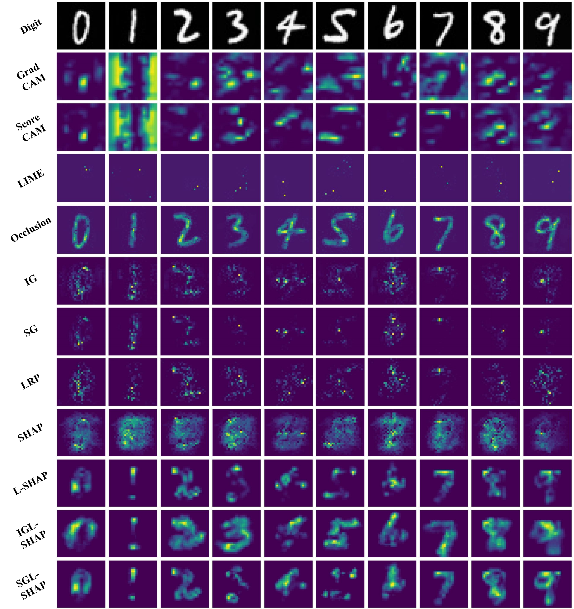

# Latent-SHAP

# Manifold-based Shapley Explanations for High Dimensional Correlated Features
This repository contains the code implementation of the paper "Manifold-based Shapley Explanations for High Dimensional Correlated Features."

## Dataset
MNIST dataset;
MSTAR dataset;

## Backbone
Our work is based on [stylegan2](https://github.com/rosinality/stylegan2-pytorch) which used as a manifold learning approach.

GAN inversion part uses [Image2stylegan](https://github.com/zaidbhat1234/Image2StyleGAN).

## Settings
### Train StyleGAN2; 
Pretrained model location: GAN_checkpoint/pretrained.pth
### Build Background Dataset for SHAP estimation；
### Prepare Network to be explained; 
Pretrained model location: checkpoint/model.pth

## Usage
demo.ipynb

## Visualization

